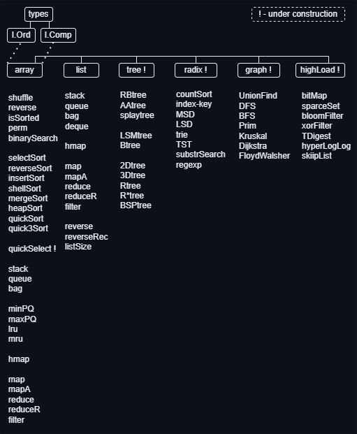

<p align="left">
	
	
	<a href="https://github.com/kselnaag/algos/blob/master/LICENSE" title="LICENSE"></a>
	<a href="https://github.com/kselnaag/algos/actions" title="Workflows"></a>
	<a href="https://kselnaag.github.io/algos" title="coverage"></a>
</p>
<p align="left">
	
	
</p>

### **ALGOS**
----

<p align="center">
  
</p>

This is the hand-made algorithms and data-structures module with go generics. It has main abstractions based on Robert Sedgewick "Algorithms" book and his Prinestone video course. There is implementation of basic versions of arrays, lists, trees, tries, graphs and some algos to work with them.

## **Types and func scheme**
<p align="center">
  
</p>

## **Motivation:**
The main idea of this module is to suggest more convenient way for sorting slices of different types. We have Buildin Data Types (BDTs: ints, floats, strings) and Combined Data Types (CDTs: self-made structures). This module dedicates `Ord` interface for BDTs with `>`, `==`, `<` operators and `Comp` interface for CDTs with `CompareTo` method and `+1`, `0`, `-1` returns. Now comparing any values all kind of types will be more easy.

## **The main idea**
We can build CDTs:
```
type Comp interface {
	CompareTo(Comp) int
}

type TestStruct struct {
	A int
	B int
}

func (s TestStruct) CompareTo(obj Comp) int {
	objComp, ok := obj.(*TestStruct)
	if !ok {
		panic(fmt.Sprintf("algos.types.TestStruct.CompareTo(obj Comp): "+
			"Type of arg is unknown, expected *types.TestStruct, actual %T", obj))
	}
	compFactor := func(st TestStruct) int {
		return st.A + st.B
	}
	this := compFactor(s)
	that := compFactor(*objComp)
	switch {
	case this < that:
		return -1
	case this > that:
		return +1
	default:
		return 0
	}
}
```

We can compare data types:
```
func LT[T any](i, j T) bool {
	switch ii := any(i).(type) {
	case Comp:
		jj := any(j).(I.Comp)
		return ii.CompareTo(jj) < 0
	case int:
		jj := any(j).(int)
		return ii < jj
	case uint:
		jj := any(j).(uint)
		return ii < jj
	case float64:
		jj := any(j).(float64)
		return ii < jj
	case string:
		jj := any(j).(string)
		return ii < jj
	default:
		panic(fmt.Sprintf("algos.types.LT[T any](i, j T): " +
			"Type of args is not processed: arg Type is: %T", i))
	}
}
```

We can sort everything:
```
func InsertSort[T any](arr []T) {
	alen := len(arr)
	for i := 1; i < alen; i++ {
		for j := i; j > 0; j-- {
			if LT(arr[j], arr[j-1]) {
				swap(arr, j, j-1)
			} else {
				break
			}
		}
	}
}
```

## **Result**
For BDTs, value slice:
```
arr := []int{3, 2, 1}
array.InsertSort(arr)
// {1, 2, 3}
```

For CDTs, pointer slice:
```
s1 := &TestStruct{1, 2}
s2 := &TestStruct{3, 1}
s3 := &TestStruct{2, 3}
arr := []*TestStruct{s3, s2, s1}
array.InsertSort(arr)
// {s1, s2, s3}
```

This approach used in arrays. Other data types are under construction and use `Ord` and `any` interfaces for Keys and Values.

----

### **LINKS**
| [samber/lo](https://github.com/samber/lo "Lodash-style Go library") | [samber/do](https://github.com/samber/do "Dependency injection toolkit based on Go 1.18+ generics") | [samber/mo](https://github.com/samber/mo "Monads based on Go 1.18+ generics") | [ialekseev/go4fun](https://github.com/ialekseev/go4fun "Functional primitives and patterns in go") |
